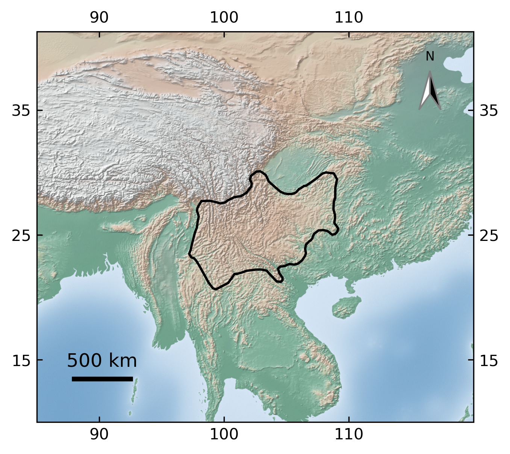
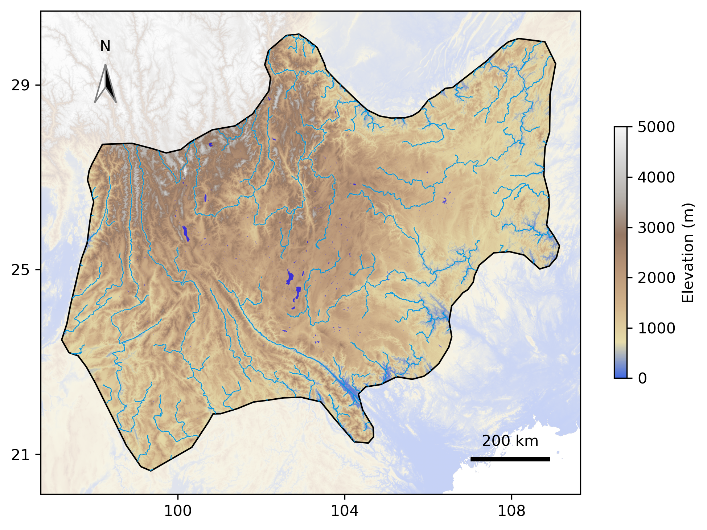
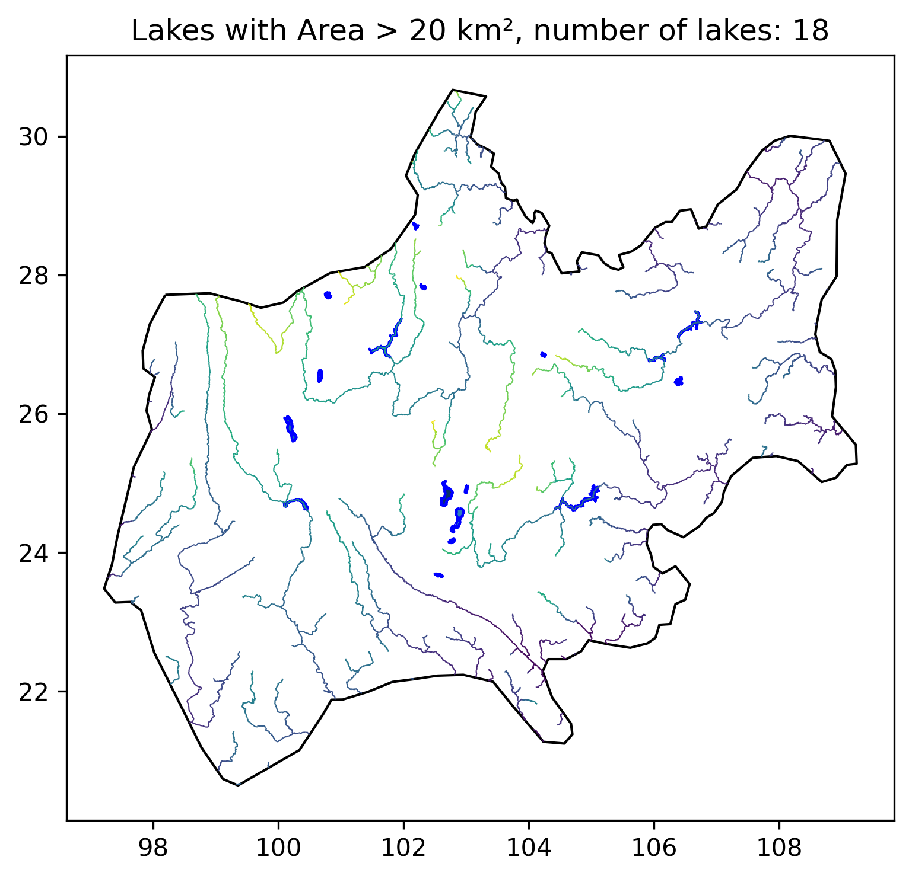
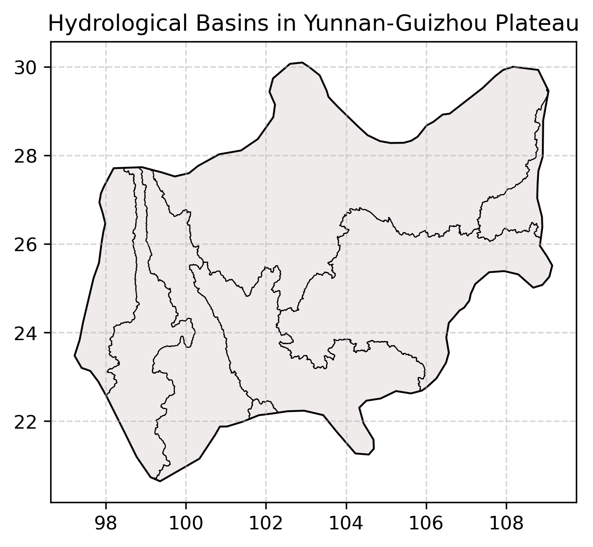

# Yunnan-Guizhou-Plateau

## Study region:

|  |  |
| --------------------- | ----------------- |

|  |  |
| --------------------------------- | ------------------------ |

TODO:
卫星测高在云贵高原水位监测中研究进展
深度学习在云贵高原水体提取中研究进展
unet模型训练及验证
unet模型水体提取应用
download ygp rsimg from gee (data-down/rsimg-down-gee/1_s2_down_TODO.ipynb)
add code to the processing/sat_altimetry           